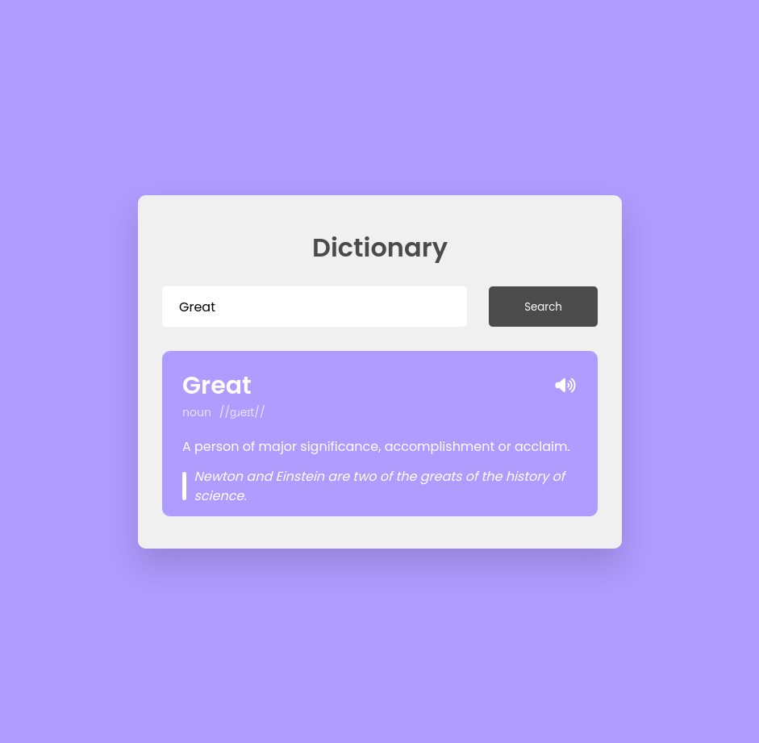

# Dictionary App

This is a simple Dictionary web application that allows you to search for word definitions and hear their pronunciation.

## Preview

## Features

- Search for word definitions.
- Listen to word pronunciation.

## Technologies Used

- HTML
- CSS
- JavaScript

## Usage

1. Enter a word in the search box.
2. Click the "Search" button or press "Enter" to look up the word.
3. View the word's definition and part of speech.
4. Click the speaker icon to hear the pronunciation.

## Credits

This app uses the [Free Dictionary API](https://dictionaryapi.dev/) to fetch word definitions and phonetics.

## License

This project is licensed under the MIT License.

## Author

Pratik Hande

Feel free to contribute and improve this project!
